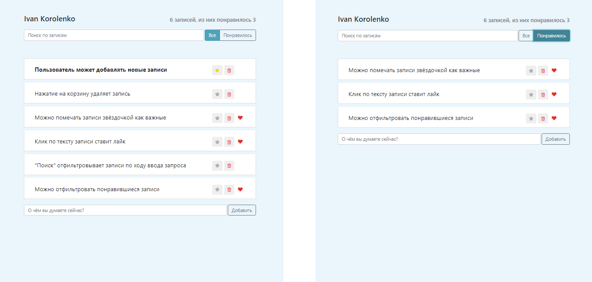

## Simple interactive application imitating wall of posts

 

The application allows to create new posts and remove existing items.   
Click the text of some post to mark it as "liked" &#x2764;&#xfe0f;.

You are welcome to see the builded version at [GitPages](https://ivankorolenko.github.io/PostWall___React/).

You also can clone this repository, install associated packages and run the application by the next commands:

#### `$ git clone https://github.com/ivankorolenko/PostWall___React.git PostWall___React`
#### `$ cd PostWall___React`
#### `$ npm install`
#### `$ npm start`

In this case you previously should become sure that <b>npm</b> and <b>React</b> are installed on you computer.